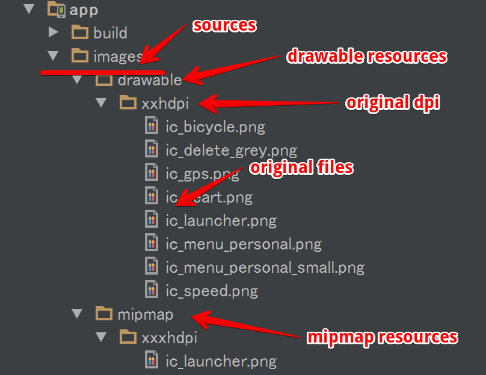
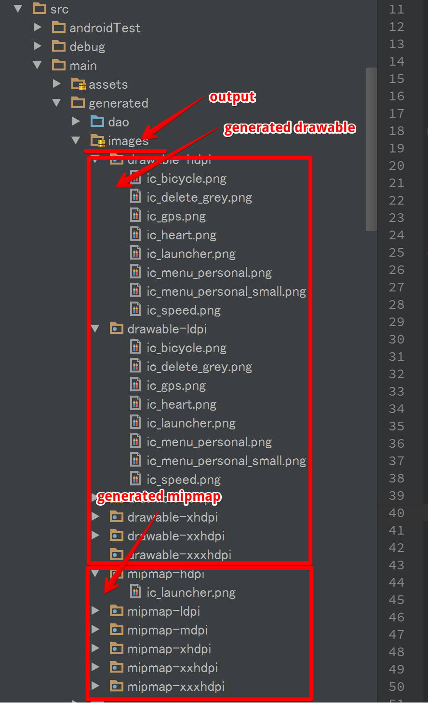

# Android Mipmap Plugin

[](https://circleci.com/gh/eaglesakura/plugin-android-mipmap)

[GroovyDoc](http://eaglesakura.github.io/maven/doc/plugin-android-mipmap/groovydoc/)

## 概要

Android アプリのビルドで使用するpng/jpeg等の画像ファイルからmipmap/drawableを自動生成するプラグインです。

変換にはImageMagickを使用するため、別途インストールが必要です。

## LICENSE

プロジェクトの都合に応じて、下記のどちらかを選択してください。

* [MIT License](LICENSE.txt)で配布します

## 使用例

### build.gradle

 1. `buildscript.repositories`ブロックにリポジトリURLを追加する
 1. `dependencies`ブロックにプラグインを追加する
 	* 現時点では1.0.5
 1. `apply plugin: 'com.eaglesakura.android-mipmap'` で有効化する
 1. `mipmap{}`ブロックを追加し、必要な情報を付与する
	 * sources = 変換元画像のディレクトリ
	 * output = 出力ディレクトリ（自動的にdrawable-mdpi等のディレクトリが作成され、そこへ画像が追加される）
	 * toolsPath.identify = `identify`コマンドのフルパス
	 * toolsPath.convert = `convert`コマンドのフルパス
 1. `androidBuildMipmap` タスクを実行する

```
buildscript {
    repositories {
        maven { url "http://eaglesakura.github.io/maven/" }
        jcenter()
        mavenCentral()
    }

    dependencies {
        classpath "com.eaglesakura:plugin-android-mipmap:1.0.5"
    }
}

apply plugin: 'com.eaglesakura.android-mipmap'

// Mipmapの入力・出力ディレクトリを指定する
mipmap {
    sources = file("images/");
    output = file("src/main/generated/images");
    toolsPath.identify = new File("C:\\dev-home\\tools\\imagemagick\\identify.exe");
    toolsPath.convert = new File("C:\\dev-home\\tools\\imagemagick\\convert.exe");
}
```

### 入力ファイルの配置例

 * 適当な/path/to/imagesディレクトリを作成し、mipmap.sourcesに指定する
 * xxxhdpiディレクトリ（ディレクトリ名はAndroidのdpi名称に従う）に配置する
 * drawable-xxhdpi等のディレクトリが自動生成され、その配下に変換された画像が配置される
 * 注意) output配下にファイルは一旦全て削除されるため、必ず*.xmlとは別なディレクトリに出力すること
 * build.gradleで下記のように修正すると、スムーズに生成されたファイルを利用できる

```
android {
    sourceSets {
        main {
            res.srcDirs = [
                    "src/main/res", "src/main/generated/images"
            ];
        }
    }
}
```




